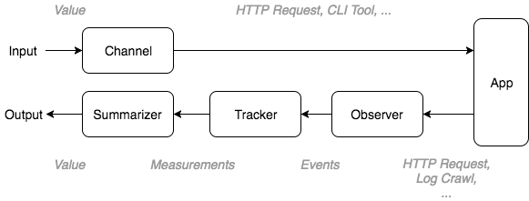

.. highlight:: yaml

.. _concepts:

Concepts
========

Before you start implementing your own performance test you must first ensure that
it's structured in the correct way. To start with, keep in mind the following:

1. The tests do not operate on the time-domain but on a user-defined axis(-es)
2. Metrics are collected for every value on the axis

Effectively this means that the performance driver explores a parameter space,
on which every point is a test case. To keep things simple you can think that
the perf driver is evaluating this function for every axis and metric:

.. math::
  f_{metric}(axis) = value

.. note::
  In the perf-driver semantics, each axis is called a *parameter*. That's
  because the values we are exploring are also the test parameters.

.. note::
  *But why are you not using the time domain?*

  If you come from the data analytics world, using a user-defined axis might come
  as a surprise. However if you consider that the ``dcos-perf-test-driver`` is
  designed to accurately and reproducibly measure an observation given a test
  scenario, you will notice that the time series is an unwanted noise.

  For example, if you want to only measure how much time it takes to deploy 1000
  applications on marathon you don't really care how much did the individual
  deployment takes. And if you want to measure the same thing for 100, 200, or 2000
  applications, collecting and summarizing the data from a time-series database
  is more trouble than help.

  Therefore by requiring the user to define his own axis, the system can abstract
  the user input as individual test scenarios, allowing it to easily group the
  results in the respective bins, even if the tests are running in parallel.

.. _concepts-summarizers:

Summarization
-------------

You will also encounter cases where you have collected more than one value for
the same axis value and metric. This can either happen because you are sampling
multiple times during the test case, or because you have configured the tests
to run multiple times for more accurate statistics.

In either way, you will end-up with multiple values for the same function:

.. math::
  f_{metric_{1}}(axis_{1}) = \begin{Bmatrix}
   value_{1}, value_{2}, value_{3} ... &
  \end{Bmatrix}

But this violates our initial assumption that the driver collects a single value
for every axis/metric combination.

You can collapse these values down to one using a *Summarizer*. As it's name
indicates it is going perform an operation to the values and reduce them to
a single scalar.

For example, if you are interested on the worst value of the series, you can
use the ``max`` summarizer. This effectively evaluates to:

.. math::
  \sum_{max} f_{metric_{1}}(axis_{1}) = max(\begin{Bmatrix}
   value_{1}, value_{2}, value_{3} ... &
  \end{Bmatrix})

But usually you are interested on the mean value, so you are going to use the
``mean`` summarizer, or even the ``mean_err`` summarizer that will also
include the uncertainty values for creating error bars.

.. note::
  The summarizer will automatically reject outliers that are not part of a Gaussian
  distribution. You can disable this behavior by setting ``outliers: no`` on the
  :ref:`statements-config-metrics` configuration.

The actual implementation of the function :math:`f` is not relevant in the conceptual
level and therefore is abstracted with the *Black Box Abstraction* as described
in the next section

.. _concepts-blackbox:

The Black Box Abstraction
-------------------------

One of the most important terms in the test driver is the *Black Box
Abstraction*. This is more like a mental abstraction that helps you design your
test in a compatible way, rather than a literal call-out to an unknown tool.

According to this, your test case is always considered a black
box with a standardized input and output. A few important things must be noted:

1. Changing something in the input starts a new test, for which some
   measurements are performed and an output is produced.

2. If the same input is given to the black box, the same output is expected.

3. A black box can take an arbitrary time to complete. In the same time other
   black boxes could run in parallel.

The **input** and the **output** to the black box is always a dictionary of scalar
values:

It's important to note that even though the *Black Box Abstraction* provides a
clean mental separation, it's implementation is not that trivial. The next section
describes how this is implemented in the driver.

Implementation
^^^^^^^^^^^^^^

The *Black Box Abstraction* is internally implemented as a set of different
components. As described in the :ref:`architecture`, these components have no
dependencies and are statically configured, therefore it's important to understand
what's their functionality in order to be properly configured.

The components taking part in the *Black Box Abstraction* are the following:

1. Every time a value is changed the **Channel** associated with this value is
   triggered. It's purpose is to apply this change to the application being
   tested. Values can be applied:

   * By HTTP requests (ex. every time a parameter changes, make an HTTP request)
   * By Calling-out to a command-line tool
   * By re-launching the application being tested with new command-line arguments

2. At the same time an **Observer** starts collecting useful events from the
   application. Such events could be:

   * Events dispatched by the application over an event bus (ex. WebSocket)
   * Events synthesized via polling (ex. life cycle events of an HTTP request,
     such as ``Started``, ``Request Sent``, ``First Bytes Arrived`` and
     ``Completed``)
   * Events synthesized via log crawling
   * Events that carry updates on application-exposed metrics (ex. by polling
     a ``/metrics`` endpoint and publishing an event every time a metric
     changes it's value)

3. A **Tracker** listens for all relevant events in the bus and calculates the
   metrics. For example:

   * Number of events observed
   * Duration between events
   * Extract values carried by the events (ex. timestamp)

4. A **Summarizer** collects all the metrics produced by the *Tracker* and
   calculates a single, "summarized" value. A summarizer could calculate:

   * The minimum value
   * The maximum value
   * The average of the values
   * The average of the values, including uncertainty values (error bars)

You can refer to the :ref:`example` to see how you can configure these components
and see them in action.
