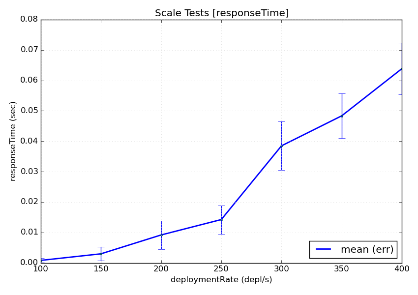

.. highlight:: yaml

.. _example:

Example
=======

Since it's difficult to understand how the system works just by looking to the
Architecture Diagram, we are going to present a complete example.

1. We are going to start by describing how we created the tests based on the
   observations we want to make.

2. Then we are describing how our decisions are written down into configuration
   files.

3. And we are going to end by describing how the test is actually executed within
   the test driver.

The testing scenario
------------------------------

We have a marathon service that runs on ``127.0.0.1:8080`` and we want to see how
well the endpoint ``/v2/groups`` is responding as the load to the ``/v2/apps``
endpoint increases.

Having read the :ref:`concepts` we decided that our axis is going to be
the "deployments per second", so ``deploymentRate`` and we are going to explore the
values from 100 to 1000 with an interval of 50.

To make sure that we are operating on a clean slate every time we also agreed
that we should wait for the previous deployments to complete before starting
the new ones.

In addition, we decided that we are going to measure how long an HTTP request to
the ``/v2/groups`` endpoint takes, so our metric is the ``responseTime`` in
seconds.

Effectively we want to measure:

.. math::
  f_{responseTime}( \begin{Bmatrix}
  100, 150, ... 1000
  \end{Bmatrix} )

Finally, since we will be constantly sampling the groups endpoint we are most
certainly going to collect more than one value for the same test case, so we
are going to use the ``mean_err`` summarizer to collect the mean values with
uncertainty information.

Having defined the ``parameters`` and the ``metrics`` in a conceptual level
we can already write them down in the configuration file.

Since they do not target any particular component they are defined in the
*global* configuration section like so:

::

  config:

    # Test parameters
    parameters:
      - name: deploymentRate
        units: depl/s
        desc: The number of deployments per second

    # Test metrics
    metrics:
      - name: responseTime
        units: sec
        desc: The time for an HTTP request to complete
        summarize: [mean_err]

You can refer to the :ref:`statements-global` for more details on what fields
you can use and what's their interpretation.

.. note::
  In the above example, the ``summarize`` field is using the compact expression
  for a built-in summarizer. The equivalent full representation would be the
  following:

  .. code-block:: yaml

      - name: responseTime
        ..
        summarize:
          - class: "@mean_err"

  The full representation allows you to customize them even further, providing
  for example a different name (ex. for the plots) or turning off the automatic
  outliers rejection.

  .. code-block:: yaml

      - name: responseTime
        ..
        summarize:
          - class: "@mean_err"
            name: "Mean (With Error)"
            outliers: no

Configuring our black box
------------------------------

According to the :ref:`concepts-blackbox` we have to configure the
components that are going to apply the changes to marathon and collect the
measurements.

Input
^^^^^

We are going to start by implementing the ``input`` direction of our black box,
and more specifically we are going to figure out which *Channel* are we going to
use for applying the changes to marathon.

As we described above we need to make ``deploymentRate``-requests per second.
Browsing through the :ref:`classref-channel` reference we notice the
:ref:`classref-channel-HTTPChannel`. According to it's documentation, it
"performs an HTTP request every time a parameter changes".

We also notice that it accepts a ``repeat`` parameter, that is repeating the
same request multiple times.

By copying the fields of interest from the reference and using the correct
:ref:`macros` we compose the following configuration fragment:

::

  channels:
    - class: channel.HTTPChannel
      url: http://127.0.0.1:8080/v2/apps
      verb: POST
      repeat: "{{deploymentRate}}"
      body: |
        {
          "id": "/scale-instances/{{uuid()}}",
          "cmd": "sleep 1200",
          "cpus": 0.1,
          "mem": 64,
          "disk": 0,
          "instances": 0,
          "backoffFactor": 1.0,
          "backoffSeconds": 0
        }

This instantiates a ``HTTPChannel`` class that is going to perform an HTTP POST
to the endpoint ``http://127.0.0.1:8080/v2/apps`` every time the value of a
macro changes. In our case, the ``deploymentRate``.

In addition, it is going to repeat this request "deploymentRate" times. This
means 100 times on the first run, 150 on the second etc. For the sake of
the example let's assume that all 1000 requests will be posted within a second
so we don't have to take any other action for satisfying the "per second" part
of the test scenario.

.. note::
  The automatic triggering of the channel when a macro changes is a bit of a
  "magic" behavior only for the channel configuration. It can be configured
  using the trigger syntax as described in :ref:`statements-channels-triggers`.

Output
^^^^^^

We are now going to implement the ``output`` of our black box. As seen in the
:ref:`concepts-blackbox` diagram we need to define an *Observer*, a *Tracker*
and a *Summarizer*. But let's see in detail what they are about.

From our test scenario, we want to measure "how long an HTTP request to the
``/v2/groups`` endpoint takes". Thus we need to plug an appropriate component
to perform this request.

We know from the documentation that the components that makes observations to the
application being tested are the **Observers**. By looking on the
:ref:`classref-observers` reference page we find out that the
:ref:`classref-observers-HTTPTimingObserver` is particularly useful in our case.

We start by copying the example from the documentation page, removing the
fields we don't need and modifying the values according to our needs

::

  observers:
    - class: observer.HTTPTimingObserver
      url: http://127.0.0.1:8080/v2/groups
      interval: 1

That's it. Now while our tests are running the ``HTTPTimingObserver`` is going
to poll the ``/v2/groups`` endpoint every second. Looking into the :ref:`classref-events`
we see that this observer broadcasts the ``HTTPTimingResultEvent`` when a
measurement is completed.

Next, we have to define a **Tracker** that is going to convert the observed
events into measurements. In our case we just need to extract the fields of
interest from the ``HTTPTimingResultEvent`` event. Again, by looking to
the :ref:`classref-tracker` reference we see that
:ref:`classref-tracker-EventAttributeTracker` is what we need.

Again, we copy the example and adjust the values to our needs:

::

  trackers:
    - class: tracker.EventAttributeTracker
      event: HTTPTimingResultEvent
      extract:
        - metric: responseTime
          attrib: responseTime

.. note::
  This might be a bit difficult to digest at a first glimpse, but it's quite
  easy after you understand what it does:

  1. It waits until a ``HTTPTimingResultEvent`` is dispatched in the bus
  2. It extracts the ``responseTime`` attribute from the event
  3. It stores it as a value for the ``responseTime`` metric that we defined
     on the first step.

.. note::
  Not all events have fields. However for the ones that have, the
  :ref:`classref-events` listing contains everything you will need to know.

Finally, you will notice that we have already defined our **Summarizer** when
we defined the metric on the first step. It's configuration belongs on the global
section because it's annotating the metric.

Having our black box defined we are going to continue with defining the
parameter evolution policy on the next step.

Defining the axis evolution
------------------------------

As we previously mentioned, we want the ``deploymentRate`` to increase gradually
from 100 to 1000 with an interval of 50. But *when* are we advancing to the next?

Answering this question will help us pick the policy are we going to use. In
principle we will need to read the :ref:`classref-policy` class reference and
pick the most fitting policy for our case, but briefly we could say:

1. Do we advance to the next value at fixed time intervals (ex. every minute)?
   Then we are going to use a :ref:`classref-policy-TimeEvolutionPolicy`.

2. Do we advance to the next value when a well-described case is met? Then we
   are going to use the :ref:`classref-policy-MultiStepPolicy`.

In our case we don't want to overload the system, so we cannot use fixed timed
intervals since an operation might take longer than expected. So we are going
to use the :ref:`classref-policy-MultiStepPolicy`.

.. note::
  We are choosing :ref:`classref-policy-MultiStepPolicy` in favor of
  :ref:`classref-policy-MultivariableExplorerPolicy`, even though they are
  very close on their features, because the former exposes a more elaborate
  configuration.

Now let's answer the other question: Which is the "well-described" case that
should be met before advancing to the next value?

In our example we are going to wait until all the deployments have completed. To
achieve this we are going to wait until the correct number of the appropriate
events is received.

Let's start first by copying the example configuration from the
``MultiStepPolicy`` and let's keep only the ``steps`` section for now. We are
going to keep only one step. Following the examples, we are using the
min/max/step configuration for the ``deploymentRate``.

::

  policies:
    - class: policy.MultiStepPolicy
      steps:

        # Explore deploymentRate from 100 to 1000 with interval 50
        - name: Stress-Testing Marathon
          values:
            - parameter: deploymentRate
              min: 100
              max : 1000
              step: 50

Technically, our policy is now syntactically correct. However, if you try to run
it you will notice that it will scan full range of options as fast as possible.
That's not what we want.

We notice on the ``MultiStepPolicy`` documentation the ``events`` section, and
in particular the ``events.advance`` event. That's exactly what we want, but
what event are we going to to listen for?

Let's consider what components do we currently have that are broadcasting events:

1. We have an ``HTTPChannel`` that broadcasts HTTP life cycle events, such as
   ``HTTPRequestStartEvent``, ``HTTPRequestEndEvent``, ``HTTPResponseStartEvent``
   and ``HTTPResponseEndEvent`` -- Not interesting.

2. We have an ``HTTPTimingObserver`` that broadcasts the measurement
   ``HTTPTimingResultEvent`` event -- Not interesting.

3. We have the ``MultiStepPolicy`` that broadcasts the ``ParameterUpdatedEvent``
   -- Not interesting.

So it looks that we are going to need a new observer. Going back to the
 :ref:`classref-observers` we notice the
 :ref:`classref-observers-MarathonPollerObserver`. From it's documentation we
 see that it subscribes to the marathon SSE event stream and brings in the
 marathon events. More specifically, the ``MarathonDeploymentSuccessEvent``
 that we need. That's perfect!

 Again, we copy the example from the documentation and we adjust to our needs

 ::

   observers:
    ...

    - class: observer.MarathonPollerObserver
      url: "http://127.0.0.1:8080"

Now that we have our observer in place, let's go back to our policy configuration
and let's add an ``events`` section with an ``advance`` field, pointing to the
``MarathonDeploymentSuccessEvent`` event:

::

  policies:
    - class: policy.MultiStepPolicy
      steps:

        # Explore deploymentRate from 100 to 1000 with interval 50
        - name: Stress-Testing Marathon
          values:
            - parameter: deploymentRate
              min: 100
              max : 1000
              step: 50

          # Advance when the deployment is successful
          events:
            advance: MarathonDeploymentSuccessEvent:notrace

Note the ``:notrace`` suffix of the event. We are using an
:ref:`classref-eventfilters` syntax to instruct the policy to ignore
tracing due to :ref:`architecture-event-cascading`, since the policy does not
have enough information to trace the ``MarathonDeploymentSuccessEvent`` and
all these events will be ignored.

.. note::
  You may wonder when you should use ``:notrace`` and when not. In principle you
  should always check the component documentation if the events it emits are
  properly cascaded and which are the event(s) they require in order to properly
  trace it. If you are properly using them you should never have to use ``:notrace``.

  However there are also cases where the events you are waiting for do not
  belong on a trace. For example, the ``TickEvent`` is sent 30 times per second,
  but it does not belong on a trace. Therefore if we don't use ``:notrace`` all
  of them will be filtered out.

  In our particular case, the :ref:`classref-observers-MarathonPollerObserver`
  requires the deployments to be started using a
  :ref:`classref-channel-MarathonDeployChannel` or a
  :ref:`classref-channel-MarathonUpdateChannel`, since it is listening for
  ``MarathonDeploymentRequestedEvent`` events in order to extract the ID of the
  app/pod/group being deployed and link it to the appropriate status update
  event.

If you test the policy now you will notice that it's indeed waiting for the
first deployment success event to arrive, but this is again not what we need.

We should wait until all the requests from the current test cases are handled.
Effectively this means waiting for *deploymentRate* number of events. This can
be easily defined using the ``advance_condition`` section and the ``events``
section:

::

  policies:
    - class: policy.MultiStepPolicy
      steps:

        # Explore deploymentRate from 100 to 1000 with interval 50
        - name: Stress-Testing Marathon
          values:
            - parameter: deploymentRate
              min: 100
              max : 1000
              step: 50

          # Advance when the deployment is successful
          events:
            advance: MarathonDeploymentSuccessEvent

          # Advance only when we have received <deploymentRate> events
          advance_condition:
            events: "deploymentRate"

.. note::
  You might wonder why we are not using the macro ``{deploymentRate}`` but we
  rather used the literal ``deploymentRate``?

  That's because according to the documentation this value can be any valid
  python expression where the parameter values and the already existing
  definitions are available in the globals.

  This allows you to have more elaborate advance conditions, such as:
  ``deploymentRate / 3`` or ``2 * deploymentRate``.

Ensuring state integrity
------------------------------

If we try to mentally process the series of actions that are going to be taken
when the tests are running, you will notice that each test case is deploying
some apps but they are never removed.

This means that we do not operate always on a clean marathon state. To mitigate
this we need to invoke an *one-time action* in between the tests. These actions
are called ``tasks`` and you can find a list of them in the :ref:`classref-tasks`
reference.

We notice that the :ref:`classref-tasks-RemoveGroup` task can come in handy,
since we are deploying apps inside the same group. We also read on the table
on the top of the page that we should trigger this task between the value
changes. So we should register the task on the ``intertest`` trigger.

Again, we copy the example configuration and we modify it to our needs:

::

  tasks:
    - class: tasks.marathon.RemoveGroup
      at: intertest
      url: "http://127.0.0.1:8080"
      group: "/scale-instances"

.. note::
  Note that with the :ref:`classref-policy-MultiStepPolicy` you can also
  customize further when some triggers are called. For example, if you want
  the ``RemoveGroup`` task to be executed *Before* each time the value is
  changed (the default is *After*), you can use the respective ``tasks`` section
  on it's configuration:

  .. code-block:: yaml

    policies:
      - class: policy.MultiStepPolicy
        steps:

          # Explore deploymentRate from 100 to 1000 with interval 50
          - name: Stress-Testing Marathon
            ...

            # Fire "prevalue" trigger before changing the value
            tasks:
              pre_value: prevalue

    tasks:

      # Register the RemoveGroup to be triggered on "prevalue"
      - class: tasks.marathon.RemoveGroup
        at: prevalue
        url: "http://127.0.0.1:8080"
        group: "scale-instances"

Reporting the results
------------------------------

Now that we have completed the test configuration it's time to describe how
and where the results will be collected.

The test driver has a variety of reporters that we can choose from. You can
see all of them in the :ref:`classref-reporter` reference. However there
is a handful that you are going frequently use. These are the reporters that
we are going to plug in our example.

Plots
^^^^^^^^^^

First of all, we are interested into getting some visual feedback with the
results. The test driver provides a :ref:`classref-reporter-PlotReporter` that
can be used in this scenario.

This reporter visualizes the *Summarized* results on a plot where the axis is
the test parameters and the values are the measured results.  An image will
be generated for every metric in the configuration.

We noticed that all the parameters of the plot reporter are optional so we
are not going to include any. This is as simple as:

::

  reporters:
    - class: reporter.PlotReporter

This would yield a ``plot-responseTime.png`` file that looks like this:

.. note::
  The plot reporter can also visualize data in two axes. In this case a 2D plot
  would be used instead.

.. note::
  The plot reporter will not function with more than two axes. That's because
  it's not possible to visualize more than two-dimensional data on a static
  image.

Machine-Readable Data
^^^^^^^^^^^^^^^^^^^^^

Of course plots are easy to read, but usually you would need the data to be
available in a machine-processable format. You can choose between two options:

* The :ref:`classref-reporter-CSVReporter` produces a comma-separated-values (CSV)
  file with the parameter values and the summarized results

* The :ref:`classref-reporter-RawReporter` produces a detailed JSON dump that
  includes everything that you would need for processing or reproducing the tests.

Since we want to be verbose, we are going to plug a ``RawReporter``:

::

  reporters:
    - class: reporter.RawReporter
      filename: "results-raw.json"

.. note::
  Having the results collected in a raw dump you can later use the
  ``dcos-compare-tool`` to compare runs.

Indicators
------------------------------

Let's say that you are running this performance test in a CI environment and you
want to see the evolution of the measurements over time. What data would you
submit to a time-series database?

Submitting the entire plot for every run is rather unhelpful, since you will end
up with too many data and you will need to come up with an elaborate data
summarization during post-processing.

Instead, you can pre-calculate a summarized value from all the observations of
every metric. You can achieve this using the *Indicators*.

An indicator receives both metrics and parameters for every test case and
calculates a single scalar value that that carries some meaningful information
from the entire run.

A frequently used one is the :ref:`classref-indicator-NormalizedMeanMetricIndicator`.
This indicator normalizes the summarized value of every test case and calculates
the mean of all these values.

You could say that for every value of ``axis_1`` and every respective measurement
of ``metric_1``, summarized using the ``sum_1`` summarizer (ex. ``mean_err``),
the indicator can be expressed as:

.. math::
  indicator =
  \frac{1}{n} \cdot
  \sum_{axis_{1} = [...]}^{n}\left (
  \frac{ \sum_{sum_{1}} f_{metric_{1}}(axis_{1}) }{ axis_{1} }
   \right )

In our example, we would like to know what's the average time it took for every
instance to be deployed. For this, we are going to calculate:

* The mean value of every deployment measurement (as we already do above)
* Then divide it (aka *normalize it*) by the number of apps being deployed
* Then calculate the mean of all the above measurements

This can be achieved using the
:ref:`classref-indicator-NormalizedMeanMetricIndicator` like so. Note that just
like ``parameters`` and ``metrics``, the ``indicators`` belong on the global
configuration:

::

  config:
    ...
    indicators:
      # Calculate `meanResponseTime` by calculating the normalizing average
      # of all the `responseTime` mean values, normalized against the current
      # deploymentRate
      - name: meanResponseTime
        class: indicator.NormalizedMeanMetricIndicator
        metric: responseTime.mean_err
        normalizeto: deploymentRate

Increasing our statistics
------------------------------

Finally, like with every statistical problem, you will most probably need to
repeat your tests until you have enough statistics.

This can be easily configured with the ``repeat`` parameter in the global
configuration section:

::

  config:

    # Repeat this test 5 times
    repeat: 5

Parameterizing your configuration
---------------------------------

You might notice that we are frequently repeating the base marathon URL
``http://127.0.0.1:8080``. To avoid this repetition we could use :ref:`macros`.

A macro is an expression contained in double brackets, such as
``{{marathon_url}}``. At run-time this macro would be replaced with the contents
of the *Definition* with the same name. For example we can change our observers
like so:

::

  observers:

    # Replace http://127.0.0.1:8080 with {{marathon_url}}
    - class: observer.HTTPTimingObserver
      url: {{marathon_url}}/v2/groups
      interval: 1

    # Also replace http://127.0.0.1:8080 with {{marathon_url}}
    - class: observer.MarathonPollerObserver
      url: "{{marathon_url}}"

The value for the macro can either be defined using a
:ref:`statements-define` statement like so:

::

  define:
    marathon_url: http://127.0.0.1:8080

Or provided by the command-line, like so:

.. code-block:: bash

  ~$ dcos-perf-test-driver -Dmarathon_url=http://127.0.0.1:8080

.. note::
  Even though it is possible to use the above command-line as-is, it's recommended
  to use the :ref:`statements-config-definitions` section to define which
  definitions can be provided from the command line.

  For example, using:

  .. code-block:: yaml

    config:
      ...
      definitions:
        - name: marathon_url
          desc: The URL to marathon to use
          required: yes

  This way, if the user does not provide the ``marathon_url`` definition, the
  driver will exit with an error, instructing the user to provide a value
  instead of silently ignoring it.

Running the tests
------------------------------

By now your configuration file should look something like the one found in
the :ref:`config-example`.

Assuming that you have saved it under the name ``scale-tests.yml`` you can launch
it like so:

.. code-block:: bash

  ~$ dcos-perf-test-driver ./scale-tests.yml

If you observe a behaviour that you don't expect, you can also run the driver in
verbose mode. In this mode you will also see the verbose, debug messages that
could be helpful to troubleshoot some problems:

.. code-block:: bash

  ~$ dcos-perf-test-driver --verbose ./scale-tests.yml

Check the :ref:`cmdline` section for more details on the command-line
